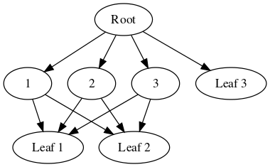

# dep_dot



A small utility to compile arbitrary directed acyclic graphs (i.e. trees) to the DOT graph description language. The anticipated use case is the visualization of dependency trees.

Two macro helpers are available for constructing graph and node literals. The graph you see to the right is produced by the following code:
```
fn main() {
    let g = G![
        N!("Root"; 0 => 1, 2, 3, 6),
        N!(1 => 4, 5),
        N!(2 => 4, 5),
        N!(3 => 4, 5),
        N!("Leaf 1"; 4),
        N!("Leaf 2"; 5),
        N!("Leaf 3"; 6),
    ];
    println!("{}", g.gen_dot().unwrap());
}
```
The output can be seen in [`example.dot`](example.dot). When this output is run through `dot` via `cargo run | dot -Tsvg -o example.svg`, you get this [`example.svg`](example.svg).
